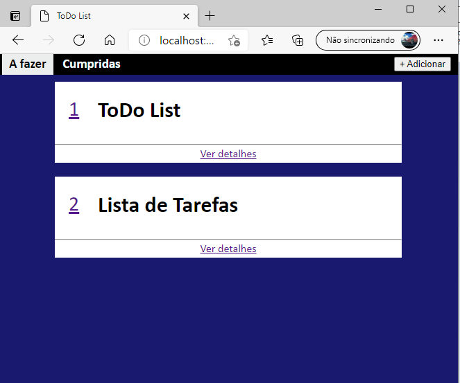
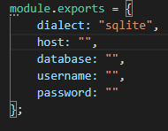

# ToDo List

Sistema de lista de tarefas que permite que elas sejam organizadas em tarefas cumpridas e tarefas a fazer. Para trocar a ordem, basta clicar no número da tarefa e digitar o novo número.

## Pré requesitos

- [NodeJS](https://nodejs.org/en/download/)
- [npm](https://www.npmjs.com/)
- **Banco de dados relacional** compatível com a biblioteca Sequelize

**o Sequelize é compatível com:**

- mssql (Microsoft SQL Server) 
- mariadb
- mysql (**esse foi o que mais testei**)
- postgres (PostgreSQL) 
- sqlite

## Como instalar

 - Baixar o repositório e descompactá-lo em uma pasta do seu computador, abrir essa pasta em um terminal e digitar o comando ``npm install`` para instalar as dependencias do sistema.
 
 - Criar um banco de dados em seu SGBD (Sistema Gerenciador de Banco de Dados) para o sistema acessá-lo (**esse passo é desnecessário se você for usar o SQLite**)

 - Alterar as configurações no arquivo "database.js" que está na pasta "config" para que o sistema possa acessar o banco de dados.

 

 - Digitar no terminal o comando ``npm start``. Uma vez iniciado, o sistema irá instalar a biblioteca necessária para acessar o dialeto de banco de dados escolhido automaticamente.

 **para acessar o sistema, digite "localhost:3000" na barra de URL de seu navegador** (eu testei o sistema usando o novo Edge baseado em Chromium)
